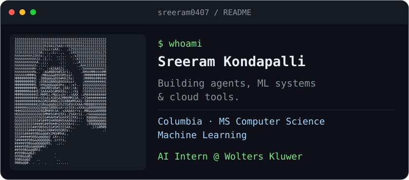

<picture>
  <source media="(prefers-color-scheme: dark)" srcset="./dark_mode.svg">
  <source media="(prefers-color-scheme: light)" srcset="./light_mode.svg">
  
</picture>

I'm **Sreeram**, an MS Computer Science student on the Machine Learning track at **Columbia University** and an **AI Intern at Wolters Kluwer**. My work spans LLM agents, machine learning and cloud infrastructure. Previously, I built data pipelines at American Express.

[LinkedIn](https://www.linkedin.com/in/sreeramkondapalli/) · [Email](mailto:sk5680@columbia.edu)

### Selected work

| Project | What I built |
| --- | --- |
| [Kubernetes Self-Healing Agent](https://github.com/sreeram0407/amlc-k8s-self-healing-agent) | On a four-person team, implemented agent code, a real Kubernetes adapter, Slack integration and deployment components. The system pairs Claude diagnosis with deterministic guardrails and an audit trail. Includes an offline demo. |
| [MedClear](https://github.com/krishrveera/MedClear) | Co-built a medical billing verification pipeline on a five-person team. Uses Claude Vision for extraction and deterministic rules for verification. **Columbia Hacking Health 2026 — Underserved Demographics Track winner.** |
| [Hybrid Chess Engine](https://github.com/sreeram0407/ChessEngine) | Combines neural position evaluation with negamax and alpha-beta search. Includes a PyGame interface and a classical-search fallback when model weights are absent. |

### Interests

LLM agents, natural language processing, and computer vision.

### Toolkit

**Code:** Python, SQL  
**ML:** PyTorch, TensorFlow, scikit-learn, NLP, computer vision  
**Infrastructure:** Docker, Kubernetes, MCP, AWS, GCP  
**Data:** PySpark, BigQuery, Oracle, SQL Server

Terminal-style layout inspired by [Andrew Grant](https://github.com/Andrew6rant). Original SVG layout using my GitHub profile portrait.
